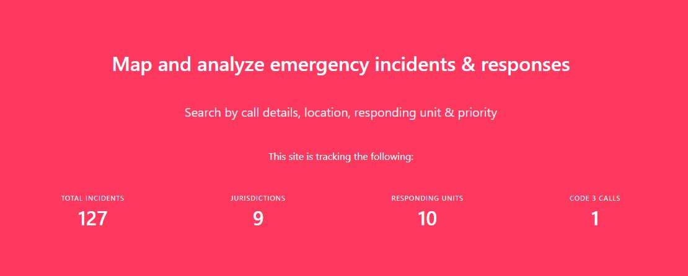
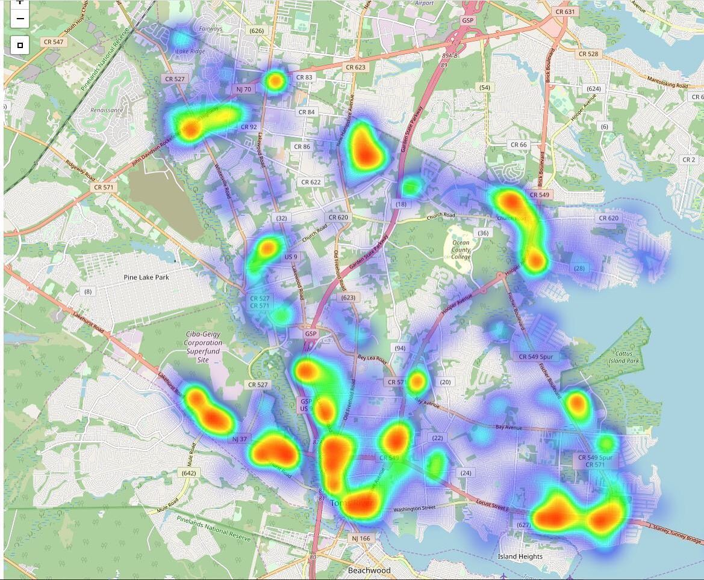

# 911maps

## Map & visualize public safety call data

This is a Django project that allows mapping and analysis of police, fire and EMS calls using data obtained from users of the [Active911](https://www.active911.com/) system.
## Analyze trends in public safety data with heatmaps

Data can be obtained from the administrators of a department using Active911 in CSV format. The data is then cleaned using scripts/clean.sh or manually using Excel (SCRIPT CURRENTLY BROKEN) and can be loaded via the Django admin interface.

## Documentation
Documentation is available [online here](https://911maps.readthedocs.io/en/latest/)

## Future Plans
This app currently supports data exported from the Active911 application currently used by some police, fire & EMS agencies.

Long-term, I want to update this to allow integration of data exports from other CAD systems, such as Spillman or even parsing the fields of data from scanned PDFs of call data released by agencies.

This app is designed to import data that has been exported from an Active911 instance. The author has obtained Active911 data [using public records requests](https://opramachine.com/request/active911_call_data_aug_2nd_oct) in order to build this app.

CSV column names from the imported data are matched with Django model fields. Once the data is imported you should be able to view it in the admin interface and on the site.

The test-data folder contains data in the appropriate format that can be used for testing the functionality of 911maps. Additional data should conform to the same schema.

*Disclaimer: This project has no affiliation with Active911, Inc. or any law enforcement agency.*
