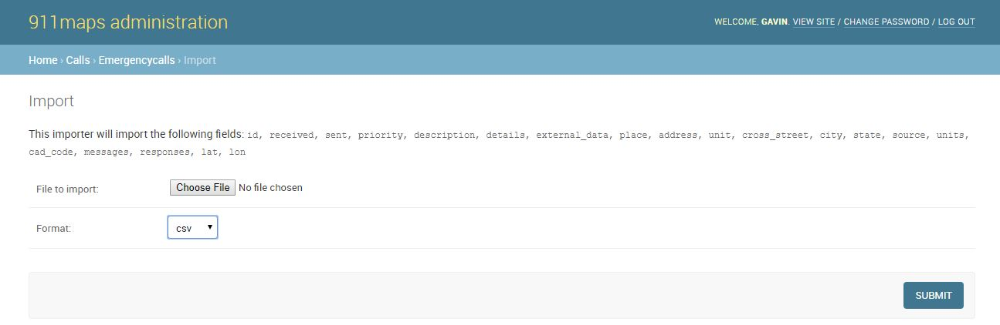
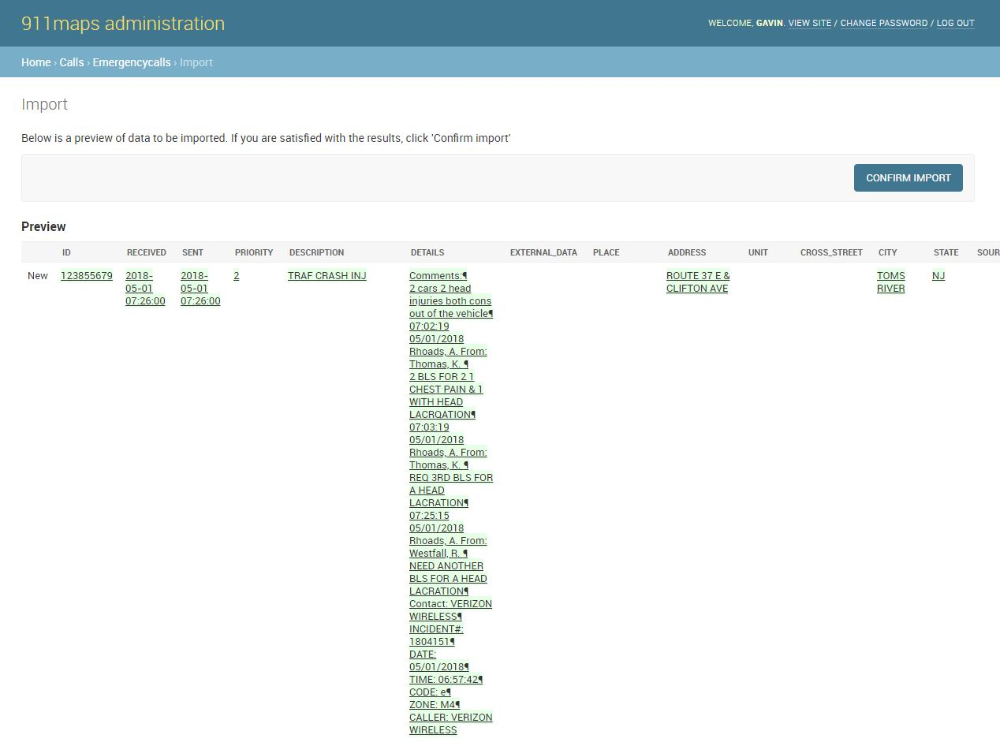

==============
Importing Data
==============
This document will show you how to import data to 911maps

Currently, 911maps only supports importing data exported from an Active911 instance,
although if you change the column names to match this schema you can try importing data
from other CAD systems although this has not yet been tested.

Data Model
==========
911maps will accept a CSV or Excel spreadsheet with some or all of the following columns of data:

id, received, sent, priority, description, details, external_data, place, address, unit, cross_street, city, state,	lat, lon, coordinate_source, source, units,	cad_code, map_code,	map_id,	alert_key, messages, responses

You can see how 911maps stores these data as Django fields at ``calls/models.py``

Uploading Data
==============
This app is designed to import data that has been exported from an Active911 instance. The author has obtained Active911 data using public records requests in order to build this app.

CSV column names from the imported data are matched with Django model fields. Once the data is imported you should be able to view it in the admin interface and on the site.

The test-data folder contains data in the appropriate format that can be used for testing the functionality of 911maps. Additional data should conform to the same schema.

Navigate to the admin interface at ``localhost:8000/admin/`` and select Emergencycalls under the "Calls" heading.

Click the 'import' button and you will be prompted to upload a file containing the fields of call data. Select the format
that matches the file you are uploading.

Click the 'submit' button to upload the data. The admin interface will warn you of any errors in validating the data. If everything looks good, you can then click "confirm import" to add the calls to the database.

Once you succesfully upload data into 911maps, it will be stored in the database and visible
in the admin interface at localhost:8000/admin/calls/emergencycall/